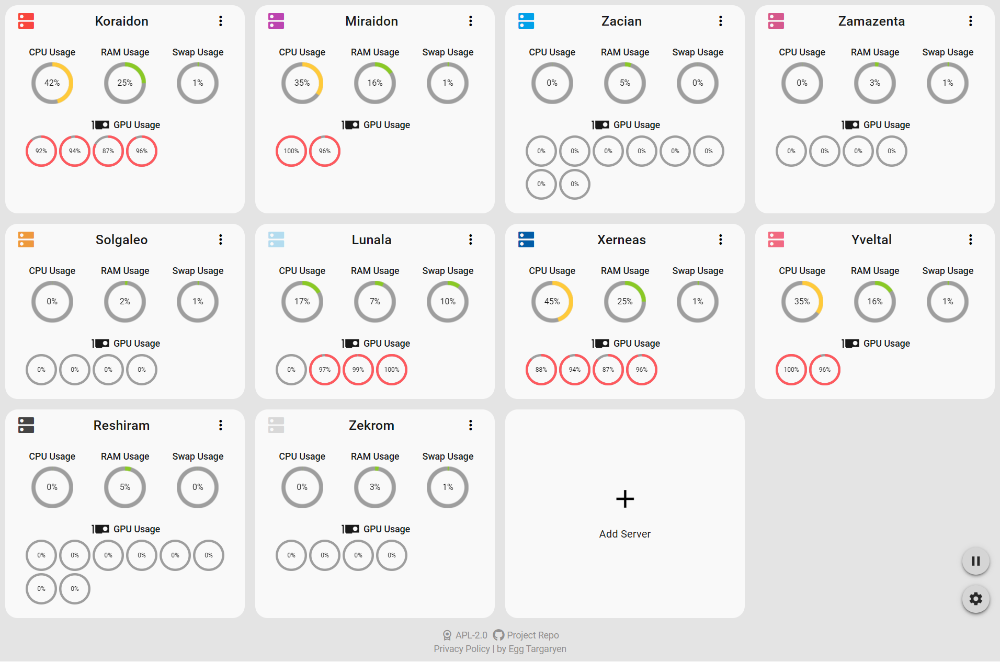
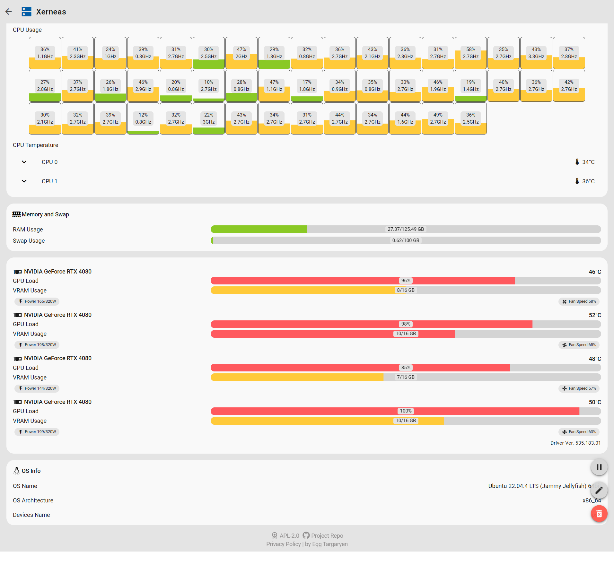

# Server Monitor

  

Lightweight server hardware status monitoring website

[简体中文](./docs/zh-CN/README.md) | [繁體中文](./docs/zh-TW/README.md) | [English](./README.md)

## Please refer to the following documents for frontend and backend deployment

- [Frontend](https://github.com/dzxrly/server-monitor/blob/frontend/README.md)
- [Backend](https://github.com/dzxrly/server-monitor/blob/backend/README.md)

## OS and Hardware Support

> [!CAUTION]
> 
> Linux have only been tested with Linux Kernel > 5.x versions, while Windows have only been tested with Windows 10 and 11.

|  Hardware  |     Linux      |  Windows  |
|:----------:|:--------------:| :-------: |
|    CPU     | ✅Fully Support | ⚠️Partial support |
|   Memory   |     ✅Fully Support      | ✅Fully Support |
|    Swap    |     ✅Fully Support      | ✅Fully Support |
| OS Info | ✅Fully Support | ✅Fully Support |
| NVIDIA GPU |     ✅Fully Support      | ✅Fully Support |
|  AMD GPU   |      ❌Not Support      |  ❌Not Support  |
| Intel GPU  |      ❌Not Support      |  ❌Not Support  |
| Other GPU  |      ❌Not Support      |  ❌Not Support  |

> For detailed information on OS and hardware support, please refer to the [Detailed List](./HardwareSupportList.md)

## Screenshots

---

by [Egg Targaryen](https://eggtargaryen.com)

