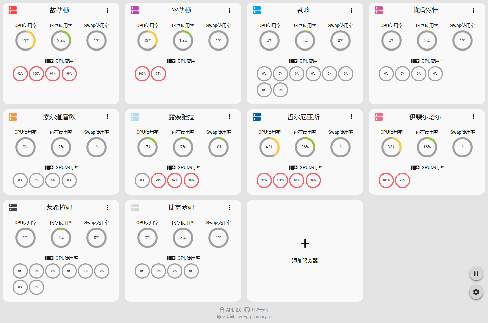
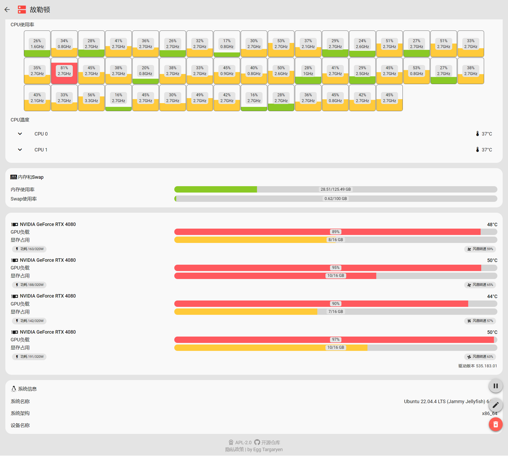

# Server Monitor

  

轻量化服务器硬件状态集中监控网站

[简体中文](../../docs/zh-CN/README.md) | [繁體中文](../../docs/zh-TW/README.md) | [English](../../README.md)

## 前后端部署请参考以下文档

- [前端部署](https://github.com/dzxrly/server-monitor/blob/frontend/docs/zh-CN/README.md)
- [后端部署](https://github.com/dzxrly/server-monitor/blob/backend/docs/zh-CN/README.md)

## 操作系统与硬件支持情况

> [!CAUTION]
> 
> Linux仅测试了 Linux Kernel > 5.x 版本的支持情况，Windows仅测试了Windows 10 与 11 的支持情况

|    硬件信息    |   Linux   |  Windows  |
| :------------: | :-------: | :-------: |
|    CPU信息     | ✅完全支持 | ⚠️部分支持 |
|    内存信息    | ✅完全支持 | ✅完全支持 |
|    Swap信息    | ✅完全支持 | ✅完全支持 |
|  操作系统信息  | ✅完全支持 | ✅完全支持 |
| NVIDIA GPU信息 | ✅完全支持 | ✅完全支持 |
|  AMD GPU信息   |  ❌不支持  |  ❌不支持  |
| Intel GPU信息  |  ❌不支持  |  ❌不支持  |
|  其他GPU信息   |  ❌不支持  |  ❌不支持  |

> 详细的操作系统与硬件支持情况请查看[详细支持列表](./HardwareSupportList.md)

## 运行时截图

---

by [Egg Targaryen](https://eggtargaryen.com)

