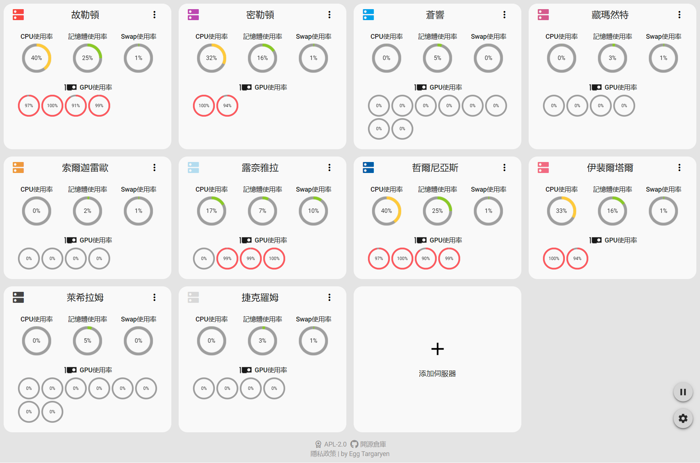
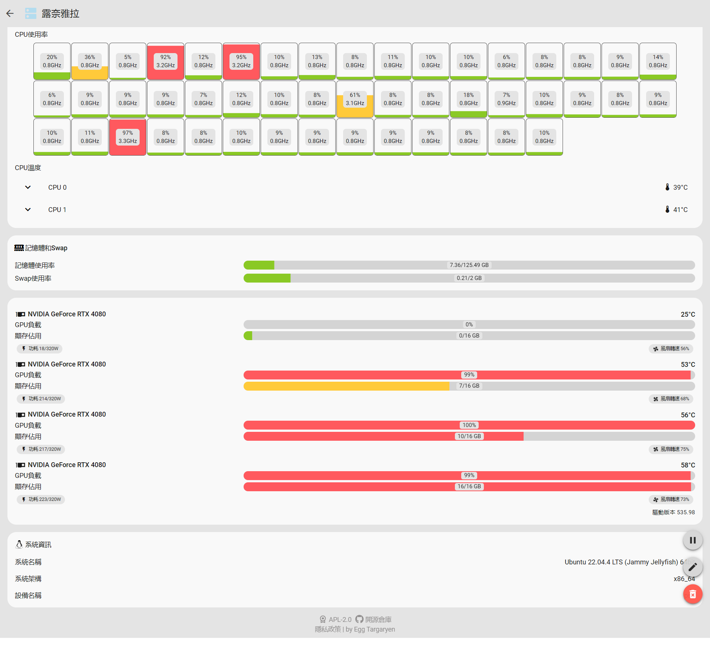

# Server Monitor

  

輕量化伺服器硬體狀態集中監控網站

[简体中文](../../docs/zh-CN/README.md) | [繁體中文](../../docs/zh-TW/README.md) | [English](../../README.md)

## 前後端部署請參考以下文檔

- [前端部署](https://github.com/dzxrly/server-monitor/blob/frontend/docs/zh-TW/README.md)
- [後端部署](https://github.com/dzxrly/server-monitor/blob/backend/docs/zh-TW/README.md)

## 作業系統與硬體支援情況詳細列表

> [!CAUTION]
> 
> Linux仅测试了 Linux Kernel > 5.x 版本的支援情况，Windows仅测试了Windows 10 与 11 的支援情况

|    硬體資訊    |   Linux   |  Windows  |
| :------------: | :-------: | :-------: |
|    CPU資訊     | ✅完全支援 | ⚠️部分支援 |
|    內存資訊    | ✅完全支援 | ✅完全支援 |
|    Swap資訊    | ✅完全支援 | ✅完全支援 |
|  作業系統資訊  | ✅完全支援 | ✅完全支援 |
| NVIDIA GPU資訊 | ✅完全支援 | ✅完全支援 |
|  AMD GPU資訊   |  ❌不支援  |  ❌不支援  |
| Intel GPU資訊  |  ❌不支援  |  ❌不支援  |
|  其他GPU資訊   |  ❌不支援  |  ❌不支援  |

> 詳細的操作系統與硬體支援情況請查看[詳細支援列表](./HardwareSupportList.md)

## 截圖

## 隱私政策

[Server Monitor隱私政策](../../Privacy.md)

---

by [Egg Targaryen](https://eggtargaryen.com)

